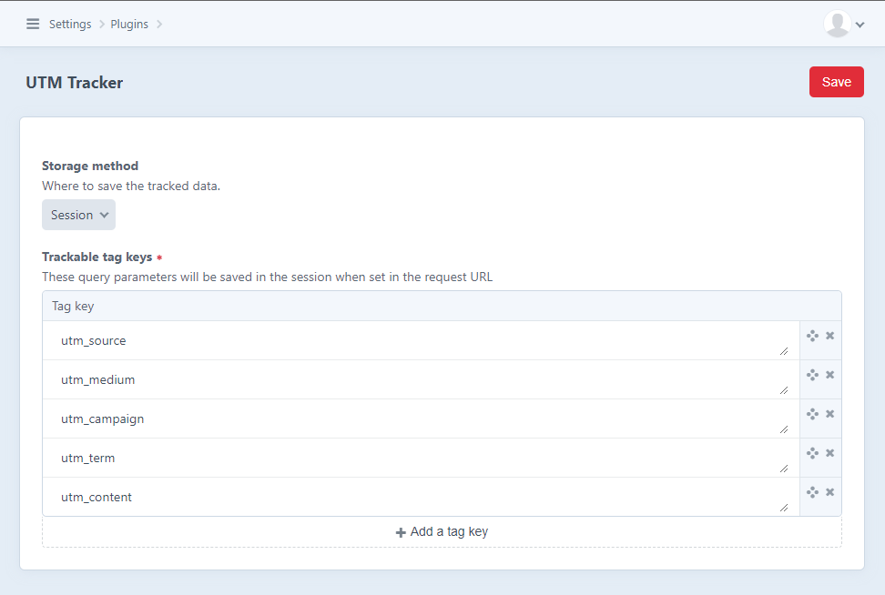

# UTM Tracker plugin for Craft CMS 3.x and 4.x

Get landing page location and query parameters when the user lands on the site. 
Keeps them in the session for use in forms or other usage in twig variables.


## Requirements

This plugin requires Craft CMS 3.7 or Craft CMS 4.

## Installation

To install the plugin, follow these instructions.

1. Open your terminal and go to your Craft project:

        cd /path/to/project

2. Then tell Composer to load the plugin:

        composer require digitalpulsebe/craft-utm-tracker

   Or when using Craft 3, use version 1:

        composer require digitalpulsebe/craft-utm-tracker:^1.0.0

3. In the Control Panel, go to Settings → Plugins and click the “Install” button for UTM Tracker.

## Configuring UTM Tracker

Configure options in the Craft control panel or create a file in config/utm-tracker.php as a copy of [config.php](src/config.php).



By default, you should keep track of these UTM tags:

- utm_source (Campaign Source, example: Google)
- utm_medium (Campaign Medium, example: email)
- utm_campaign (Campaign Name, example: xmas2022)
- utm_term (Campaign Term, example: christmas+presents)
- utm_content (Campaign Content, example: version+A)

Also, the landing URL and referrer URL are tracked when the session is created.

Other configuration (config/utm-tracker.php) options are: 

- 'cookieName': the name of the cookie (when used)
- 'cookieLifetime': lifetime of the cookie in seconds (when used)

## Usage

Available twig variables:

```
{{ craft.utmTracker.landingUrl }}
  {# example: https://example.com/pages/detail #}
  
{{ craft.utmTracker.absoluteLandingUrl }}
  {# with query parameters, example: https://example.com/pages/detail?param=1 #}
  
{{ craft.utmTracker.referrerUrl }} 
  {# example: https://google.com/ #}
  
{{ craft.utmTracker.tag('utm_campaign') }}
  {# one tag by key #}

{{ craft.utmTracker.tags|json_encode }}
  {# all tags in an array #}
```

### Using UTM Tracker in combination with Freeform

1. Create hidden fields and add them to your form
2. Render tag with default value filled from the available variable properties

example: 
```
{{ form.render({
   'storedValues': {
      'myHiddenField': craft.utmTracker.landingUrl
   }
}) }}
```

### Using UTM Tracker in combination with Formie

1. Create hidden fields and add them to your form
2. Before rendering, pass along the values to formie

example: 
```

```

## Notice: tracking user data

Don't forget to notify the user details are tracked to comply to the GDPR rules.
When you select the cookie storage method an extra cookie is created.
The name and lifetime of the cookie is configurable in the config file. By default, the key is 'utm_tracking_parameters'.
